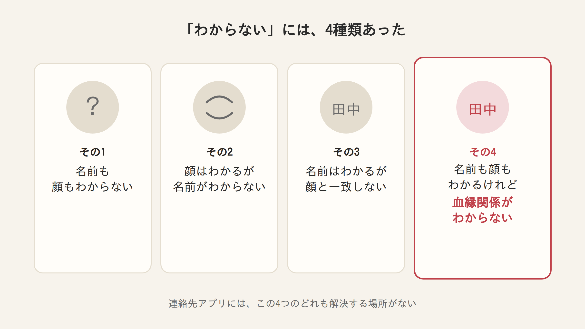
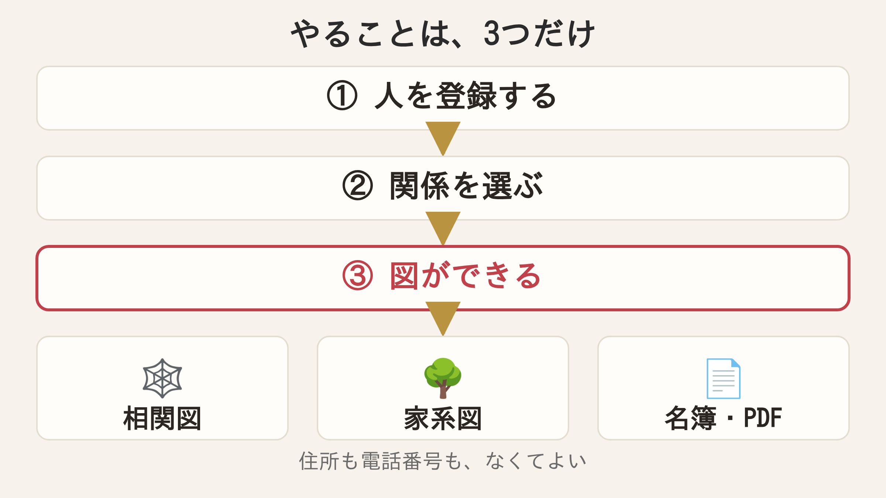
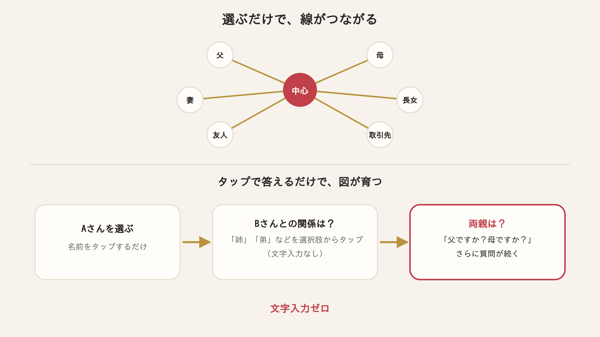
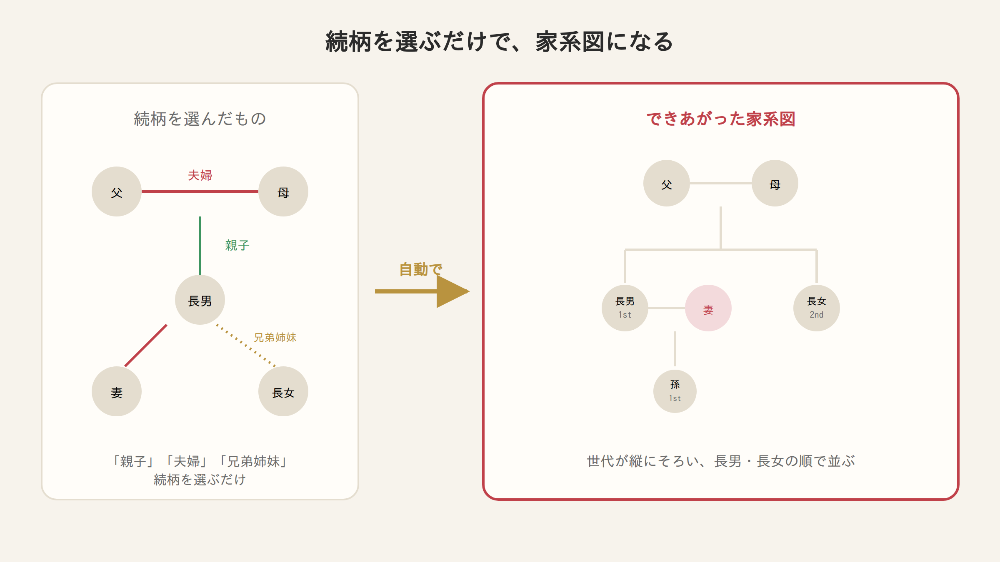
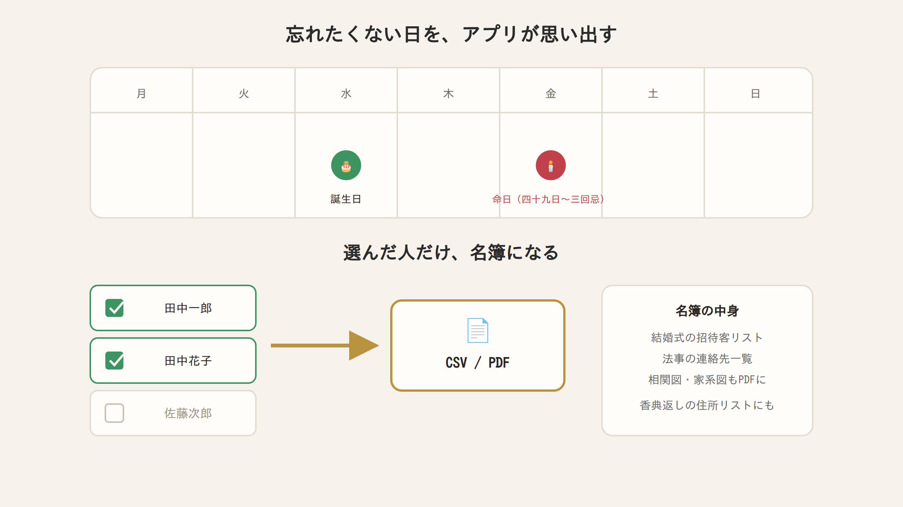
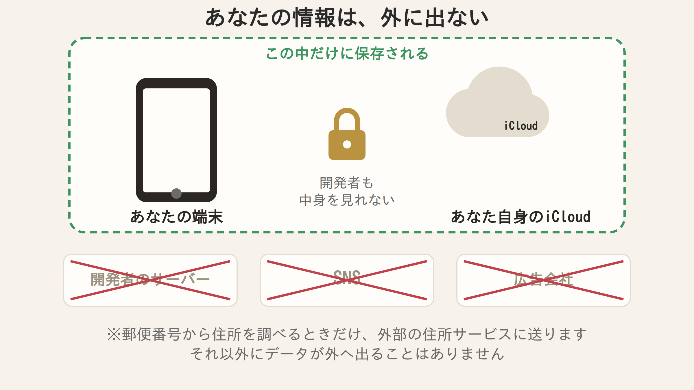

# 本文ドラフト（note 貼り付け用）

> **使い方**
> 図1〜図6は `note/img/fig1.png`〜`fig6.png` として用意済みです。
> note の編集画面で、それぞれの図の位置に画像をアップロードしてください（本文はそのまま貼れます）。
> note の編集画面では、`##` が大見出し、`###` が小見出しになります。

---

## タイトル

顔は知られているのに、私は誰なのか分からなかった。父の葬儀で作ったアプリの話

---

## 本文

去年、父が亡くなりました。80歳になる少し手前でした。

葬儀には、父のいとこや兄弟が来てくれました。年代が年代なので、当然のことです。
私は父にそっくりらしく、誰が見ても「この人は息子だ」とわかるようです。
実際、来てくれた方々にとって、私が誰なのかは一目瞭然だったと思います。

でも、こちらからは違いました。
**目の前にいるこの人が、いったい誰なのか。私にはわかりませんでした。**

親族なのか、友人なのか。親族だとして、いとこなのか、もっと遠い人なのか。
どういう関係の人なのか、見当がつかないまま挨拶をするので、
当たり障りのない会話にしかなりません。

*（note にアップロード：`note/img/fig1.png`）*

---

## 「どこどこのおばちゃん」問題

田舎あるあるだと思うのですが、うちの親戚には**地域名で呼ばれている人**が結構いました。

「横浜のおばちゃん」「どこどこのおじちゃん」。
「林田兄ちゃん」のように苗字がついていればまだ照合できるのですが、
地域名＋続柄だけで通っている人になると、もう手がかりがありません。

一段落したあとに、いとこの中でも親しい人間と話していて気づいたのが、
自分がわからなかった「わからなさ」には、実は**4種類ある**ということでした。

1. そもそも名前を知らない
2. 顔は知っているが、名前を知らない
3. 名前は知っているが、顔と一致しない
4. 名前も顔も知っているが、**どういう血縁関係かわからない**

連絡先アプリには、この4つのどれも解決する場所がありません。
名前と電話番号は書けても、「この人が誰の何なのか」を書く欄がないからです。

---

## 香典返しのリストで、完全に詰まった

葬儀が終わってひと段落したころ、**香典返しの住所リスト**を葬儀屋に渡す必要が出てきます。
香典をいただいた以上、当然お返しをしないといけません。

ここで、さっきの「わからなさ」が全部そのまま返ってきました。
名前が出てこない人、顔と名前が一致しない人、血縁関係がわからない人。
そのままではリストが作れません。

結局そのときは、いとこの中でも親しい人間と一緒に、**手書きで家系図を作って整理**しました。
一段落つくころには、なんとか間に合わせることができました。

でも、これは一度きりでは終わらない話です。
また誰かの葬儀があれば、同じことが起きます。
四十九日、一周忌、三回忌と、法事はこの先も続きます。
**その都度、記憶とみんなの手書きに頼るのは、さすがに無理があるな**と思いました。

これが、このアプリを作ろうと思ったきっかけです。

---

## で、どんなアプリなの？

ひとことで言うと、**人と人の「関係」を登録していくと、図が勝手にできるアプリ**です。

やることは3つだけです。

1. 人を登録する
2. 「この人は、誰の何か」を選ぶ
3. 図ができる

*（note にアップロード：`note/img/fig2.png`）*

住所も、電話番号も、覚えていなければ入れなくて構いません。
**名前と、誰とのつながりか。それだけで動きます。**

---

## ①「誰が誰の何か」を選ぶだけで、線がつながる

ドラマの相関図、ありますよね。人物の顔が並んでいて、線の上に「兄」「元恋人」と書いてあるやつです。あれと同じものが、選ぶだけでできます。

*（note にアップロード：`note/img/fig3.png`）*

血縁関係の整理は、結局のところコツコツ入力していくしかありません。
それなら一番使うのはスマホだろう、ということでアプリにしたのですが、作るときに決めていたことが1つあります。

**できるだけ、文字を打たずに済ませる。**

自分はIT系の仕事をしていて、パソコンの扱いには慣れているほうだと思います。
それでも、スマホで文字を打つのはかなり嫌いです。だったら、タップだけで進められる作りにしよう、と思いました。

具体的にはこんな流れです。

> AさんとBさんがいて、姉と弟の関係だとします。
> Aさんを選んで、Bさんを選んで、関係を「姉」「弟」で選ぶ。
> すると次に「AさんとBさんには両親がいますよね？」と聞かれるので、
> 「この人は父親ですか？母親ですか？」というふうに、質問がポンポン出てきます。
> それに答えていくだけで、相関図と家系図がどんどん育っていきます。

一郎から花子へ、花子からその父へ、父からその兄へ。
**一度に全部を入力する必要はありません。** 質問に答えていけば、図のほうが少しずつ育っていきます。

---

## ② 続柄を選んでいくだけで、家系図ができていた

これが自分でも作ってよかったと思っている機能です。

相関図のほうは、友人や仕事関係、自由入力まで、関係を好きに登録できます。
ただそのなかで、「親子」「夫婦」「兄弟姉妹」といった**続柄**を選んでおくと、家系図はそこだけを自動で拾って、世代ごとに縦に並べてくれます。

家系図を手で描いた方ならわかると思うのですが、あれは**線を引く作業より、並び順を決める作業のほうが大変**です。世代をそろえて、長男を左に置いて、その配偶者を隣に置いて……とやっていると、一人足すたびに全部描き直しになります。

*（note にアップロード：`note/img/fig4.png`）*

それだけで、世代が縦に並んだ日本式の家系図ができます。
長男・長女・次男といった順番も、生年月日から自動で並びます。

iPad や Mac の大きい画面なら、何世代あっても一度に見渡せます。
iPhone で入れたものが、そのまま iPad と Mac にも出てきます。

---

## ③ 忘れたくない日を、アプリのほうから思い出してくれる

誕生日と記念日、それから**命日**の通知が入れられます。

命日は四十九日から三回忌まで対応しています。
これは自分が必要だったから入れました。法事の日付は、数え方が独特で、毎回カレンダーを見ながら計算することになるからです。

*（note にアップロード：`note/img/fig5.png`）*

それから、**選んだ人だけを CSV や PDF に書き出せます**。

結婚式の招待客リスト、法事の連絡先一覧。
このあたりは結局エクセルで作り直すことになりがちですが、チェックを付けて書き出すだけで済みます。相関図と家系図も、そのまま PDF にできます。

写真も、その人ごとに残せます。
撮影日を入れておくと「1972年6月14日（19歳）」のように、**その人が何歳ごろの写真か**が自動で表示されます。

これを作ったきっかけは、正直半分おふざけです。
葬式でも結婚式でも、「甥っ子・姪っ子、でかくなったねえ」という会話がよくあります。それなら、その子のページに写真を載せて「何歳の時の写真か」がわかるようにしておけばいいじゃないか、と。

古い写真をまとめて残しておきたい方には、いまのところここがいちばん喜ばれています。
ゆくゆくは「自分が何歳のとき、この姪っ子は何歳だった」というふうに、**一人の人物の歴史がまるごとわかる**ようなところまで育てたいと思っています。

登録の手間についても書いておくと、名刺や免許証をカメラで読み取って、名前や住所の候補を出す機能も入れています。
（正直まだ精度は発展途上です。ここは今後上げていきます。）
iPhone の連絡先から取り込むこともできます。

---

## 親戚の情報、どこに保存されるのか

いちばん先に説明しておきたいところです。

**登録した内容は、あなたの端末と、あなた自身の iCloud にしか保存されません。**

*（note にアップロード：`note/img/fig6.png`）*

このアプリは、他のアプリよりずっと多くの個人情報を扱います。名前、続柄、写真、記念日。だからこそ、**開発者であるこちら側からデータを抜くことは一切しない**というのを、いちばんの方針にしています。

データを外に出すかどうかは、完全にユーザーの意思だけです。私が中身を見ることもできませんし、誰かとつながる機能もないので、SNS のように他人に見られることもありません。

例外は1つだけです。
**郵便番号から住所を自動入力するときだけ**、外部の住所サービスに郵便番号を問い合わせます。それ以外にデータが外に出ることはありません。

家族の情報を扱うアプリなので、ここは隠さず全部書いておきます。

なお、起動時に Face ID・Touch ID・パスコードでロックをかけられます。
人に画面を見せる場面のために、名前を伏せて表示する機能もあります。

---

## LINEでも電話でもない、もう1つの連絡先

正直に言うと、このアプリは誰にでも便利なアプリではないと思っています。

頻繁に連絡を取る相手なら、電話・SMS・LINE・メールで十分です。
そこを置き換えるつもりはありません。

このアプリが向いているのは、**そんなに頻繁には連絡を取らないけれど、何かあったときのために連絡先を押さえておかないといけない人**です。

身内に不幸があった。連絡をしないといけない。でも、誰に連絡すればいいかわからない。
これを防ぐために、普段からコツコツ連絡先を貯めておいて、いざというときに使う。そういうアプリです。

これは冠婚葬祭に限りません。たとえば、名刺交換だけした取引先の人。
半年も経つと「あれ、この人は何を知ってる人だっけ」「そもそもこの会社は何の会社だっけ」となります。忘れたころに連絡を取りたくなる、というのはよくあることだと思います。

結婚して、相手側の親戚がまだ覚えきれていない時期。
法事や葬儀を、自分が仕切ることになったとき。
親から家系の話を聞いたとき。

――どれも、距離が遠すぎたり疎遠すぎたりして、連絡先の登録がおろそかになりがちな人たちです。
そういう人たちを、確実に把握しておくために使ってもらえたらと思っています。

おまけの使い方としては、相関図や家系図、アルバムを PDF にして、知り合いにペロッと渡す、というくらい気軽に使ってもらっても構いません。

---

## お金の話

人を登録して、図を作るところまでは**無料**です。

CSV・PDF の書き出し、アプリからの連絡、図の画像保存などをまとめて使いたくなったときだけ、**700円の買い切り**をご用意しています。
月額ではありません。一度払えば、それで終わりです。

iPhone 版をお持ちの方は、Mac 版を追加のお支払いなしでお使いいただけます。

---

## これから

まだ足りないところがたくさんあります。
使ってみて「ここが使いづらい」「こういう関係が登録できない」というものがあれば、ぜひ教えてください。個人で作っているので、いただいた声はだいたいそのまま次の更新に入ります。

遠い親戚のことも、疎遠になった人のことも、
忘れてしまう前に、手元に残しておいてもらえたらうれしいです。

▼ App Store（iPhone / iPad / Mac）
https://apps.apple.com/jp/app/id6777648250

---

## ハッシュタグ

#個人開発 #アプリ開発 #iOSアプリ #家系図 #エッセイ
